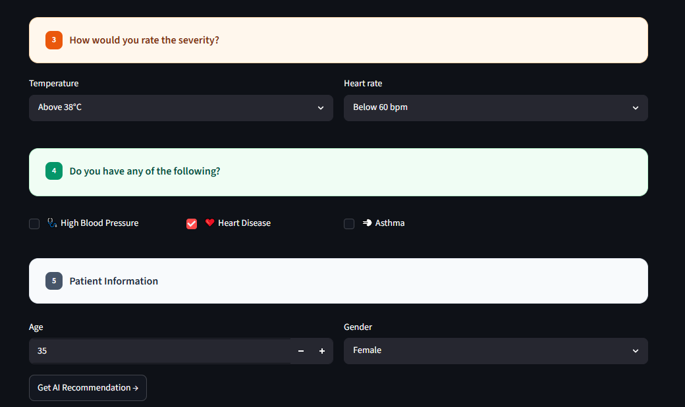
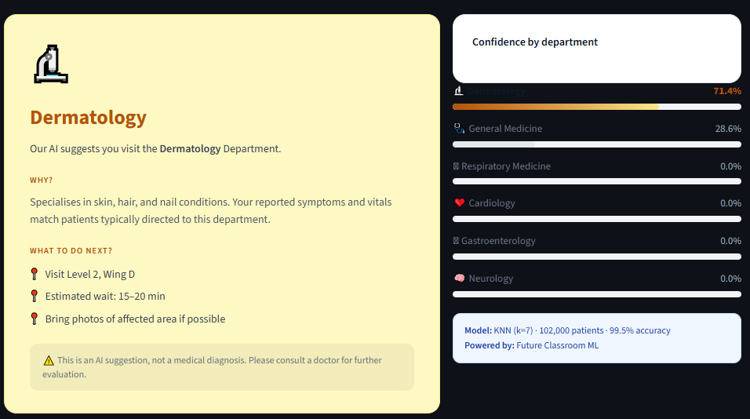

# 🏥 Smart Hospital Patient Navigator


Aplikasi web berbasis **Machine Learning** yang membantu pasien menentukan poli/departemen rumah sakit yang paling sesuai berdasarkan gejala, durasi keluhan, tingkat keparahan, dan riwayat medis yang diinput. Dibangun dengan **Streamlit** dan model klasifikasi **K-Nearest Neighbors (KNN)**.

**Live Demo:** [driins-smarthospital.streamlit.app](https://driins-smarthospital.streamlit.app)

> ⚠️ **Disclaimer:** Aplikasi ini merupakan proyek edukasi (Future Classroom) dan **bukan alat diagnosis medis**. Hasil rekomendasi tidak menggantikan konsultasi dengan tenaga medis profesional.

---

## Latar Belakang Proyek

Pasien yang datang ke rumah sakit sering kali bingung harus mendaftar ke poli apa, terutama untuk gejala yang tidak spesifik. Ketidaktepatan ini bisa menyebabkan antrian ulang, waktu tunggu lebih lama, dan beban kerja tambahan bagi petugas pendaftaran.

**Smart Hospital Patient Navigator** dibangun untuk menjawab masalah ini: pasien cukup mengisi gejala yang dirasakan, lalu sistem ML akan merekomendasikan departemen yang paling relevan lengkap dengan tingkat keyakinan prediksi dan panduan langkah selanjutnya.

---

## 🛠️ Tech Stack

| Kategori | Tools |
|---|---|
| Programming Language | Python |
| Web App / UI | Streamlit, HTML & CSS custom |
| Machine Learning | scikit-learn (K-Nearest Neighbors) |
| Data Processing | Pandas, NumPy |
| Model Persistence | Pickle |
| Deployment | Streamlit Community Cloud |

---

## Fitur

- **Form triase interaktif** dalam 5 bagian: gejala, durasi keluhan, tingkat keparahan (suhu & detak jantung), riwayat penyakit, dan data pasien.
- **Rekomendasi departemen otomatis** dari 6 poli: Respiratory Medicine, Cardiology, Gastroenterology, Neurology, General Medicine, dan Dermatology.
- **Tingkat keyakinan (confidence score)** untuk setiap departemen, ditampilkan dalam bentuk progress bar.
- **Panduan langkah selanjutnya** (lokasi, estimasi waktu tunggu, dan tips) sesuai departemen yang direkomendasikan.
- UI modern dan responsif dengan tema warna khusus per departemen.

---

## Cara Kerja

1. Pengguna mengisi form gejala, durasi, keparahan, riwayat medis, dan data diri (usia & gender).
2. Data diproses dan sebagian fitur numerik dinormalisasi menggunakan `scaler` yang sudah dilatih.
3. Model KNN (`hospital_model.pkl`) memprediksi departemen yang paling sesuai beserta probabilitas untuk tiap kelas.
4. Hasil prediksi ditampilkan lengkap dengan penjelasan dan langkah tindak lanjut.

**Detail model:**
- Algoritma: K-Nearest Neighbors (k = 7)
- Dataset: ± 102.000 data pasien
- Akurasi: 98.2%

---

## Struktur Proyek

```
.
├── hospital_app.py        # Kode utama aplikasi Streamlit
├── hospital_model.pkl     # Model terlatih (model, scaler, mapping fitur)
└── requirements.txt       # Daftar dependensi
```
---

## Skill yang Didemonstrasikan

- Membangun dan melatih model klasifikasi Machine Learning (KNN) untuk kasus multi-class.
- Melakukan preprocessing data (encoding label & normalisasi fitur numerik dengan scaler).
- Menyimpan dan memuat model ML ke production menggunakan Pickle.
- Membangun antarmuka web interaktif dengan Streamlit, termasuk custom styling (CSS).
- Mendesain UX form multi-step yang mudah dipahami pengguna awam.
- Melakukan deployment aplikasi ML ke cloud (Streamlit Community Cloud).

---

---

## 🗂️ Format `hospital_model.pkl`

File pickle ini berisi dictionary dengan struktur berikut:

| Key | Deskripsi |
|---|---|
| `model` | Model KNN yang sudah dilatih |
| `scaler` | Objek scaler (`StandardScaler`) untuk normalisasi fitur numerik |
| `features` | Daftar nama kolom fitur input model |
| `cols_to_scale` | Daftar kolom yang dinormalisasi |
| `dept_map_inv` | Mapping index prediksi → nama departemen |
| `gender_map` | Mapping label gender → nilai numerik |
| `temp_map` | Mapping label suhu tubuh → nilai numerik |
| `hr_map` | Mapping label detak jantung → nilai numerik |
| `dur_map` | Mapping label durasi gejala → nilai numerik |
| `cc_map` | Mapping label keluhan utama → nilai numerik |

---

## Tampilan Aplikasi

1. **Header** — judul dan deskripsi aplikasi.
2. **Form Input** — gejala (checkbox), durasi & keluhan utama, tingkat keparahan, riwayat penyakit, dan data pasien.
3. **Hasil Rekomendasi** — nama departemen, alasan rekomendasi, langkah selanjutnya, dan grafik confidence tiap departemen.

Form Input

Hasil Rekomendasi


---

## Rencana Pengembangan

- [ ] Menambahkan lebih banyak departemen/poli dan variasi gejala.
- [ ] Integrasi dengan sistem antrian rumah sakit secara real-time.
- [ ] Membandingkan performa model KNN dengan algoritma lain (Random Forest, XGBoost, dsb).
- [ ] Menambahkan dukungan multi-bahasa (Indonesia & English).

---

## Lisensi

Proyek ini dibuat untuk tujuan edukasi. Bukan alat diagnosis medis pasti
